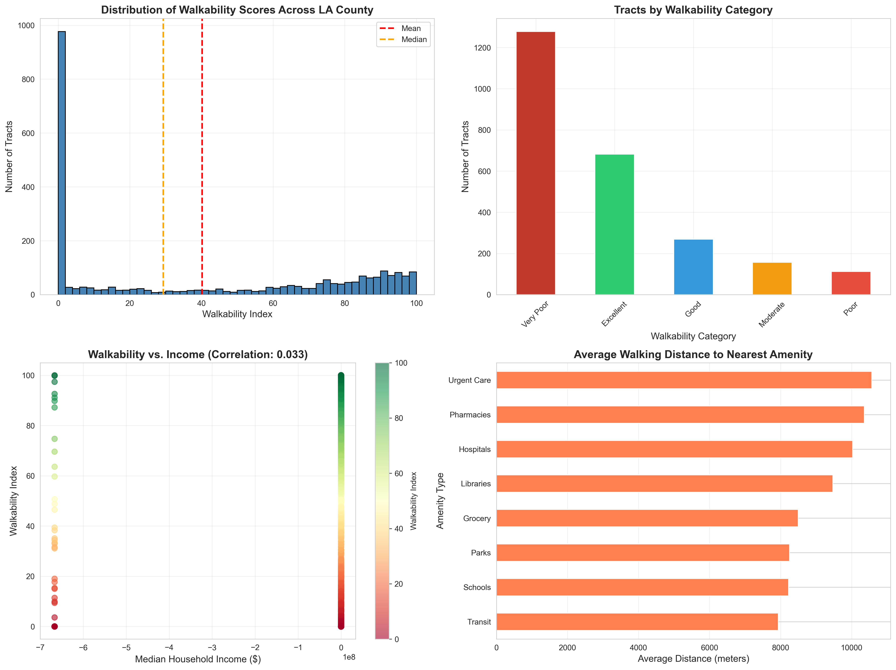

# Urban Equity Analysis - Los Angeles County

**Identifying Underserved Neighborhoods Through Walkability and Amenity Accessibility Analysis**



## 🎯 Project Overview

This project uses geospatial analysis and machine learning techniques to identify neighborhoods in Los Angeles County that lack adequate access to essential amenities like parks, grocery stores, hospitals, and public transit. By calculating network-based walking distances and creating a composite walkability index, the analysis reveals significant urban equity gaps affecting over 6 million residents.

### Key Findings

- **60.2% of LA County's population (6 million people)** lives in areas with poor walkability
- **1,390 census tracts** (55.7%) are classified as underserved
- Average walking distance to essential amenities: **8-10 km** (far beyond walkable range of 1-2 km)
- Walkability shows **very weak correlation with income** (r=0.033), indicating this is a spatial planning issue affecting all socioeconomic levels

## 🛠️ Technical Stack

- **Geospatial Analysis:** GeoPandas, Shapely, OSMnx
- **Network Routing:** NetworkX (Dijkstra's algorithm for shortest path calculations)
- **Data Sources:** US Census Bureau API, OpenStreetMap
- **Visualization:** Folium (interactive maps), Matplotlib, Seaborn
- **Data Processing:** Pandas, NumPy

## 📊 Methodology

### 1. Data Collection
- **Census Tracts:** 2,498 tracts covering LA County with demographic data
- **Demographics:** Population, income, age, race/ethnicity from Census ACS 5-year estimates
- **Amenities:** 14,209 points of interest from OpenStreetMap
  - Categories: Parks, hospitals, grocery stores, schools, transit stops, pharmacies, libraries, urgent care
- **Street Network:** 248,784 nodes and 733,360 edges representing walkable routes

### 2. Distance Calculation
- Calculate **actual walking distances** using street network routing (not straight-line "as the crow flies")
- Employ Dijkstra's algorithm to find shortest walking path from tract centroid to nearest amenity
- Pre-filter candidates using Euclidean distance for computational efficiency
- Generate 16 features per tract: distance to nearest + count within 1km for each of 8 amenity types

### 3. Walkability Index Creation
- Convert distances to scores (0-100) based on walking time thresholds
  - Ideal: <400m (5 min walk) = 100 points
  - Acceptable: 400-1000m (12 min walk) = 70-100 points  
  - Poor: 1000-2000m (25 min walk) = 30-70 points
  - Very Poor: >2000m = <30 points
- Weight amenities by importance (grocery stores: 25%, parks: 20%, transit: 15%, etc.)
- Composite index combines all amenity scores into single 0-100 metric
- Classify tracts: Excellent (80+), Good (65-79), Moderate (50-64), Poor (35-49), Very Poor (<35)

### 4. Equity Analysis
- Correlation analysis with demographic variables (income, population density)
- Identification of spatial clusters of underserved areas
- Policy recommendations based on findings

## 📁 Project Structure
```
Urban-Equity-Analysis/
├── src/
│   ├── datacollection/       # Census API, OSM data collection scripts
│   ├── preprocessing/         # Data cleaning, validation, spatial joins
│   ├── features/             # Distance calculation, walkability index
│   └── visualization/        # Interactive maps, static charts
├── data/                     # Generated locally (not in repo)
│   ├── raw/                 # Raw data from APIs
│   └── processed/           # Cleaned, merged datasets
├── outputs/                  # Visualizations and reports
├── requirements.txt
└── README.md
```

## 🚀 Getting Started

### Prerequisites
- Python 3.8+
- Census API key (free): https://api.census.gov/data/key_signup.html

### Installation

1. Clone the repository:
```bash
git clone https://github.com/jaranade/UrbanEquityAnalysis.git
cd UrbanEquityAnalysis
```

2. Install dependencies:
```bash
pip install -r requirements.txt
```

3. Create `.env` file with your Census API key:
```
CENSUS_API_KEY=your_key_here
```

### Run the Analysis
```bash
# Step 1: Collect data (30-60 minutes)
python run_data_collection.py

# Step 2: Preprocess data (5 minutes)
python run_preprocessing.py

# Step 3: Calculate walking distances (30-60 minutes)
python src/features/calculate_distances.py

# Step 4: Create walkability index (10 seconds)
python src/features/create_walkability_index.py

# Step 5: Generate visualizations (20 seconds)
python src/visualization/create_walkability_map.py
```

### View Results

- **Interactive Map:** Open `outputs/walkability_map_interactive.html` in your browser
- **Static Charts:** View `outputs/walkability_analysis.png`
- **Summary Report:** Read `outputs/walkability_report.txt`

## 📈 Results

### Walkability Distribution

| Category | Tracts | Population | Percentage |
|----------|--------|------------|------------|
| Excellent | 682 | 2,334,078 | 27.3% |
| Good | 269 | 1,045,641 | 10.8% |
| Moderate | 157 | 608,803 | 6.3% |
| Poor | 112 | 442,732 | 4.5% |
| Very Poor | 1,278 | 5,588,381 | 51.2% |

### Average Walking Distances to Amenities

- **Parks:** 8.25 km
- **Grocery Stores:** 8.49 km  
- **Hospitals:** 10.03 km
- **Transit Stops:** 7.93 km
- **Schools:** 8.22 km

*These distances far exceed the generally accepted walkable range of 1-2 km, indicating severe car dependency across most of LA County.*

## 💡 Key Insights

1. **Urban-Suburban Divide:** Well-served areas concentrate in dense urban cores (Downtown LA, Koreatown, West LA), while suburban and peripheral areas lack walkable access to essential services

2. **Income-Independent Issue:** Very weak correlation (r=0.033) between walkability and household income suggests this is primarily a spatial planning and development pattern issue, not simply a poverty-related problem

3. **Public Health Implications:** 
   - Limited access to parks affects recreation and mental health
   - Food deserts (lack of grocery stores) impact nutrition
   - Distance to healthcare facilities creates barriers to medical care

4. **Policy Recommendations:**
   - Prioritize mixed-use development in underserved areas
   - Implement transit-oriented development around existing transit nodes
   - Strategic placement of new parks and essential services in identified gaps
   - Incentivize neighborhood-scale retail in residential areas

## 🔄 Future Enhancements

- Machine learning models to predict walkability scores from urban characteristics
- Classification models to identify tract-level risk factors for poor access
- Time-series analysis of how walkability has changed with development
- Expansion to other major US cities for comparative analysis  
- Integration of additional factors (crime/safety, sidewalk quality, topography, traffic)
- Simulation tools to model impact of proposed new amenity locations

## 📚 Data Sources & References

- **US Census Bureau:** Demographic data, census tract boundaries (TIGER/Line shapefiles)
- **OpenStreetMap:** Amenity locations, street network data
- **Methodology Inspired By:**
  - EPA National Walkability Index
  - 15-Minute City urban planning concept
  - Academic research on food deserts and healthcare access

## 📄 License

This project is open source and available under the MIT License.

## 👤 Author

**Anjali G**
- GitHub: [@jaranade](https://github.com/jaranade)
- UC Riverside - M.S. in Computational Data Science

## 🙏 Acknowledgments

- US Census Bureau for providing comprehensive demographic data through their API
- OpenStreetMap contributors for mapping community amenities
- OSMnx developers for creating powerful street network analysis tools

---

**Note:** Data files are not included in this repository due to size constraints. Run the data collection scripts to generate them locally. Total processing time: ~2 hours.
